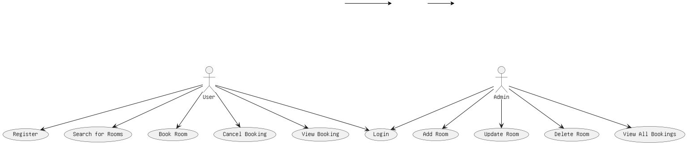

# Requirement Analysis in Software Development

## Introduction

This repository contains the complete documentation for the **Requirement Analysis** phase of a Booking Management System. It is part of the ALX Software Engineering Program and is designed to simulate a real-world software development scenario. The aim is to build a clear and structured foundation for successful system implementation by identifying and analyzing all essential requirements.

---

## What is Requirement Analysis?

Requirement Analysis is a fundamental phase in the Software Development Life Cycle (SDLC). It involves gathering, documenting, and analyzing the requirements of stakeholders to ensure a clear understanding of what the system is expected to do.

The goal of this phase is to create a blueprint that guides the entire development process. This blueprint helps developers, designers, and testers remain aligned with user needs and business objectives.

---

## Why is Requirement Analysis Important?

1. **Reduces Development Risk**  
   By identifying potential issues early, Requirement Analysis minimizes the risk of project failure, delays, and rework.

2. **Improves Communication**  
   It bridges the gap between stakeholders and the development team by ensuring everyone has a shared understanding of expectations.

3. **Ensures Project Alignment**  
   Helps align the final software product with business goals, user needs, and regulatory requirements.

---

## Key Activities in Requirement Analysis

- **Requirement Gathering**  
  Collecting information from stakeholders through interviews, surveys, and observations.

- **Requirement Elicitation**  
  Extracting detailed needs and constraints through techniques like brainstorming, workshops, and prototyping.

- **Requirement Documentation**  
  Recording all requirements in a structured format for communication and review.

- **Requirement Analysis and Modeling**  
  Analyzing collected data to identify gaps, conflicts, and ambiguities. Visual models are created to aid understanding.

- **Requirement Validation**  
  Ensuring the documented requirements accurately reflect stakeholder needs and are feasible within constraints.

---

## Types of Requirements

### Functional Requirements

These define what the system should do.

**Examples for the Booking Management System:**
- Users can create, view, edit, and cancel bookings.
- Admins can manage room availability and user information.
- The system sends booking confirmation emails to users.

### Non-functional Requirements

These describe how the system performs under various conditions.

**Examples:**
- The system must respond within 3 seconds for 95% of user actions.
- Data should be encrypted during transmission and at rest.
- The system must support up to 10,000 concurrent users.

---

## Use Case Diagrams

Use Case Diagrams represent the interaction between system actors (users) and the system. They help visualize the system’s functionality at a high level and provide clarity on what actions users can perform.

> _Note: The diagram shows main actors like “User” and “Admin,” and key use cases such as “Book Room,” “Cancel Booking,” “Login,” and “Manage Bookings.”_  
> _Diagram created using [Draw.io](https://draw.io)_

---

## Acceptance Criteria

Acceptance Criteria define the conditions under which a feature is considered complete and working as intended. It ensures that both the development team and stakeholders have a common understanding of feature requirements.

### Example: Checkout Feature in the Booking System

- User must be logged in to perform checkout.
- System displays summary of selected booking details.
- User must confirm details before proceeding.
- Payment gateway should load successfully and securely.
- Confirmation message and booking reference must be shown upon successful payment.

---

## License

This project is part of the ALX Software Engineering Program and is licensed for educational use.

